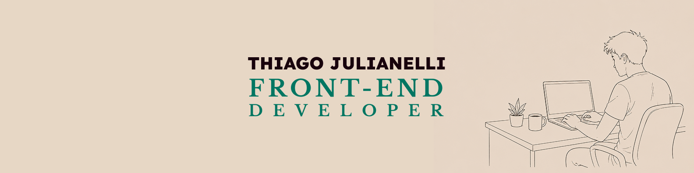

# Portfólio 2026

Mais do que apenas um espaço para reunir projetos, este portfólio foi pensado como uma extensão visual da forma como enxergo desenvolvimento front-end: interfaces claras, objetivas e com identidade própria.

O projeto busca fugir da sensação genérica que muitos portfólios transmitem, apostando em uma experiência mais humana, direta e memorável, sem abrir mão da simplicidade.

---

## A proposta

A ideia principal era simples: responder rapidamente quem eu sou, o que faço e do que sou capaz. Toda a construção da interface foi guiada por isso.

Ao invés de excesso de animações, seções desnecessárias ou layouts extremamente corporativos, optei por uma abordagem mais limpa e editorial, priorizando:

- leitura rápida
- hierarquia visual forte
- personalidade visual
- navegação intuitiva
- clareza das informações

---

## Conceito visual

A identidade visual do projeto foi construída para transmitir proximidade e autenticidade.

A combinação entre:

- tons terrosos
- tipografia marcante
- bastante espaço visual
- ilustrações leves
- contraste entre blocos claros e escuros

ajuda a criar uma interface que foge do padrão "template de portfólio", mas ainda mantém uma experiência profissional e organizada.

A intenção nunca foi parecer extravagante, e sim memorável.

---

## Filosofia técnica

Apesar do visual mais elaborado, a arquitetura do projeto segue uma linha simples e objetiva.

O portfólio foi desenvolvido utilizando tecnologias nativas da web, buscando aprofundar domínio sobre a própria plataforma antes de depender de abstrações maiores.

Por isso, o projeto utiliza:

- HTML
- JavaScript puro
- TailwindCSS
- Web Components API

---

## Componentização com Web Components

Os componentes reutilizáveis da interface foram desenvolvidos utilizando a Web Components API através de Custom Elements.

Essa abordagem permitiu criar estruturas mais organizadas e reutilizáveis sem necessidade de frameworks front-end completos.

Os Custom Elements foram utilizados principalmente na construção do carrossel de projetos, ajudando na separação de responsabilidades e manutenção do código.

---

## Design responsivo

A responsividade foi tratada como parte central do projeto desde o início.

O layout foi planejado para preservar:

- legibilidade
- identidade visual
- organização dos elementos
- conforto de navegação

em diferentes tamanhos de tela. Tanto a prototipação quanto o desenvolvimento foram feitos por mim. [Clique aqui para acessar o protótipo no figma.](https://www.figma.com/design/TGeu6XqwfOzRgnnkEWtE5R/Portfolio-2026?node-id=0-1&p=f&t=IHuFUD2GG5EFbHWo-0)

---

## Tecnologias utilizadas

- HTML5
- JavaScript (ES6+)
- TailwindCSS
- Web Components API
- CSS Variables

---

## Objetivos do projeto

- Criar um portfólio com identidade visual própria
- Explorar recursos nativos da plataforma web
- Praticar componentização sem frameworks
- Desenvolver uma interface clara e objetiva
- Demonstrar habilidades práticas de front-end

---

## Aprendizados

Durante o desenvolvimento deste projeto, pude aprofundar conhecimentos em:

- componentização nativa da web
- arquitetura front-end sem frameworks
- organização visual de interfaces
- responsividade
- reutilização de componentes
- experiência do usuário
- hierarquia visual

---
